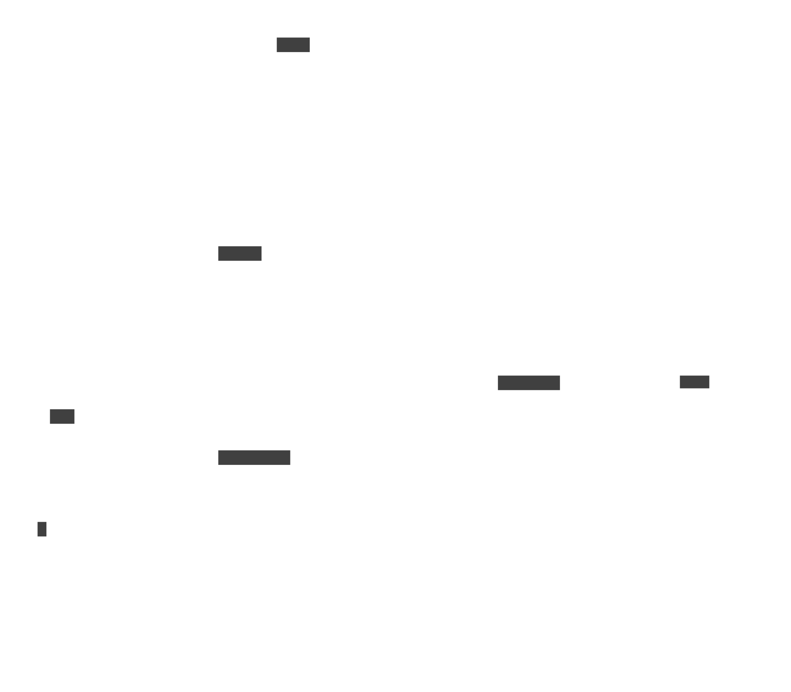
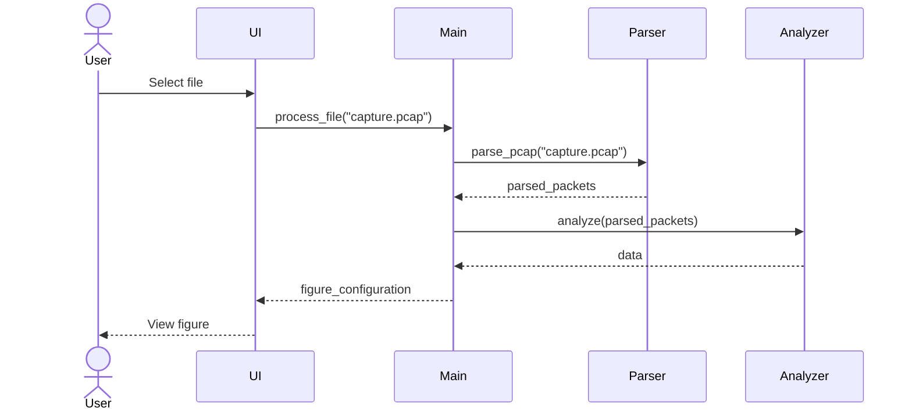

# Arkkitehtuuri
## Yleiskuva
Ohjelma käynnistyy main.py tiedostolla, joka luo sovellukselle Context-olion tilatiedon tallentamiseksi.
main hoitaa yhteydet tietokantaan storage-moduulin kautta, suorittaa parsinnan packet_parser-moduulin avulla, analysoi paketit analyzer-moduulin avulla, ja lopuksi paketoi tulokset käyttöliittymälle sopivaan muotoon FigureConfig-olioiksi.

Parsinnan tuloksena tieto tallennetaan Packet-olioihin, jotka sisältävät Layer-olioita. Layer-oliot konfiguroidaan LayerConfig-olioilla, joilla jokaisella on LayerLevel attribuuttinsa, joka ilmaisee sen sijainnin neliportaisessa verkkopinossa: link, network, transport ja application.

## Tietorakenteet
Ohjelma pitää parsittua ja rikastettua tietoa muistissa Pandas-kirjaston DataFrame-oliossa, jossa jokainen paketti
vie yhden rivin, ja sen attribuutit ovat jokainen eri sarakkeessa.

Pysyväistallennus tapahtuu viemällä DataFrame SQLite tietokantaan.

### Tietokanta
Sarakkeiden määrään ja nimiin vaikuttaa suoraan parsittujen pakettien sisältö, joka luonnollisesti
vaihtelee sen mukaan, mitä tiedostoa analysoidaan. Näin ollen jokaiselle tallennuspaikalle tehdään oma taulu,
jonka nimeksi tulee tallennuspaikan ID.

Tallennuspaikkojen ID ja käyttäjälle näkyvä nimi yhdistetään toisiinsa "slots" taulussa.

## Sekvenssikaavio
Oheinen kaavio esittää ylätasolla, miten tapahtuu PCAP-tiedoston valinta, parsinta, analysointi ja
visualisoinnin konfigurointi.
