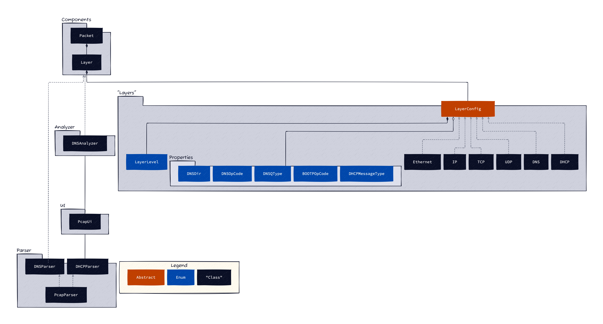

```d2
# SHARED PROPERTIES
direction: up
classes: {
  package: {
    shape: package
    label.near: outside-top-left
    style.font-size: 28
  }
  dependency: {
    style.stroke-dash: 3
    target-arrowhead: {
      shape: arrow
    }
  }
  implementation: {
    style.stroke-dash: 3
    target-arrowhead: {
      shape: triangle
      style.filled: false
    }
  }
  composition: {
    target-arrowhead: {
      shape: diamond
      style.filled: true
    }
  }
  aggregation: {
    target-arrowhead: {
      shape: diamond
      style.filled: false
    }
  }
  enum: {
    style.fill: "#0047AB"
    shape: class
  }
  abstract: {
    style.fill: "#C04000"
    shape: class
  }
  "class": {
    shape: class
  }
}

# Objects
UI: {
  class: package
}
Analyzer: {
  class: package
  DNSAnalyzer: {
    class: class
  }
}
Parser: {
  class: package
  PcapParser: {
    class: class
  }
  DNSParser: {
    class: class
  }
  DHCPParser: {
    class: class
  }
  PcapParser -> DNSParser: {
    class: dependency
  }
  PcapParser -> DHCPParser: {
    class: dependency
  }
}
Components: {
  class: package
  Layer: {
    class: class
  }
  Packet: {
    class: class
  }
  Layer -> Packet: {
    class: composition
  }
}
\"Layers": {
  LayerLevel -> LayerConfig: {
    class: composition
  }
  Properties -> LayerConfig: {
    class: aggregation
  }
  class: package
  LayerLevel: {
    class: enum
  }
  LayerConfig: {
    class: abstract
  }
  Ethernet: {
    class: class
  }
  IP: {
    class: class
  }
  TCP: {
    class: class
  }
  UDP: {
    class: class
  }
  DNS: {
    class: class
  }
  DHCP: {
    class: class
  }
  Ethernet -> LayerConfig: {
    class: implementation
  }
  IP -> LayerConfig: {
    class: implementation
  }
  TCP -> LayerConfig: {
    class: implementation
  }
  UDP -> LayerConfig: {
    class: implementation
  }
  DNS -> LayerConfig: {
    class: implementation
  }
  DHCP -> LayerConfig: {
    class: implementation
  }
  Properties: {
    class: package
    DNSDir: {
      class: enum
    }
    DNSOpCode: {
      class: enum
    }
    DNSQType: {
      class: enum
    }
    BOOTPOpCode: {
      class: enum
    }
    DHCPMessageType: {
      class: enum
    }
  }
}
UI: {
  PcapUi: {
    class: class
  }
}

# Inter-container links
Parser -> Components: {
  class: dependency
}
Analyzer -> Components: {
  class: dependency
}
\"Layers".LayerConfig -> Components.Layer: {
  class: composition
}
Parser -- UI -- Analyzer

# Explaining colors
Legend: {
  Abstract: {
    class: abstract
  }
  Enum: {
    class: enum
  }
  \"Class": {
    class: class
  }
  style.fill: "#FFFAF0"
}
```