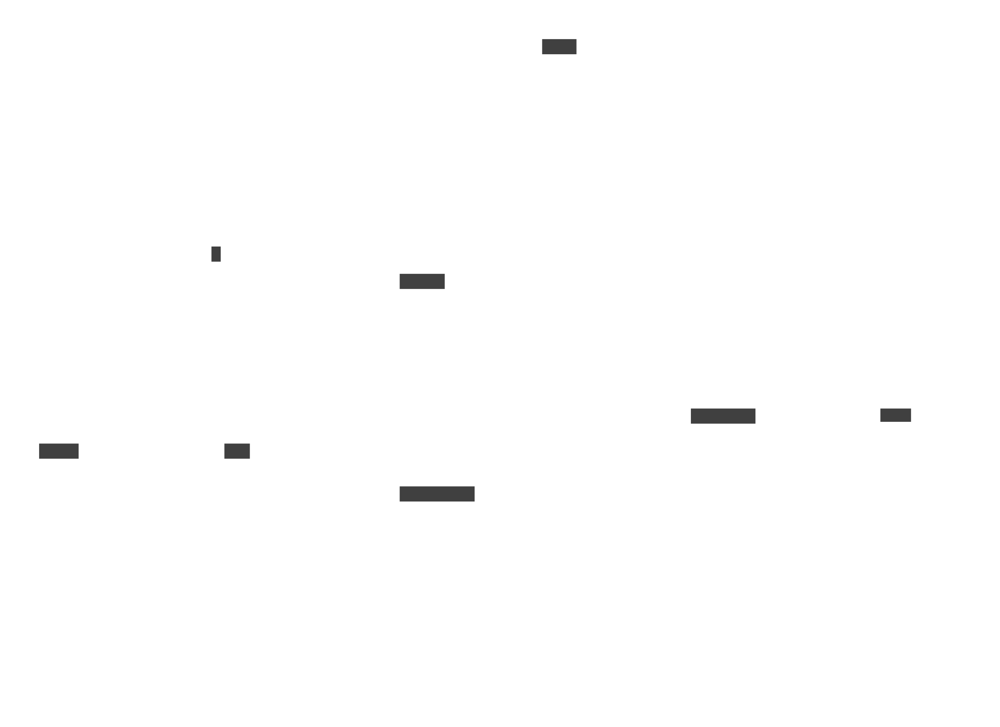
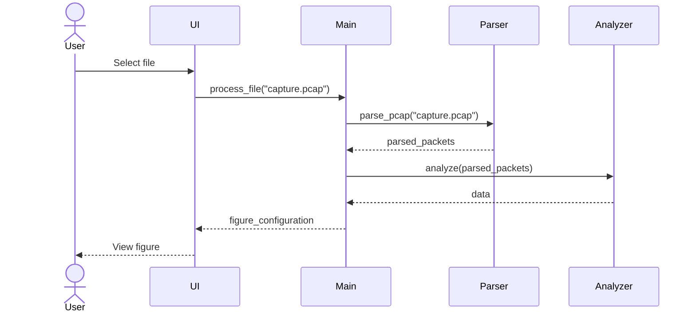

# Arkkitehtuuri
## Yleiskuva

## Sekvenssikaavio
Oheinen kaavio esittää ylätasolla, miten tapahtuu PCAP-tiedoston valinta, parsinta, analysointi ja
visualisoinnin konfigurointi.

```mermaid
sequenceDiagram
  actor User
  participant UI
  participant Main
  participant Parser
  participant Analyzer
  User->>UI: Select file
  UI->>Main: process_file("capture.pcap")
  Main->>Parser: parse_pcap("capture.pcap")
  Parser-->>Main: parsed_packets
  Main->>Analyzer: analyze(parsed_packets)
  Analyzer-->>Main: data
  Main-->>UI: figure_configuration
  UI-->>User: View figure
```