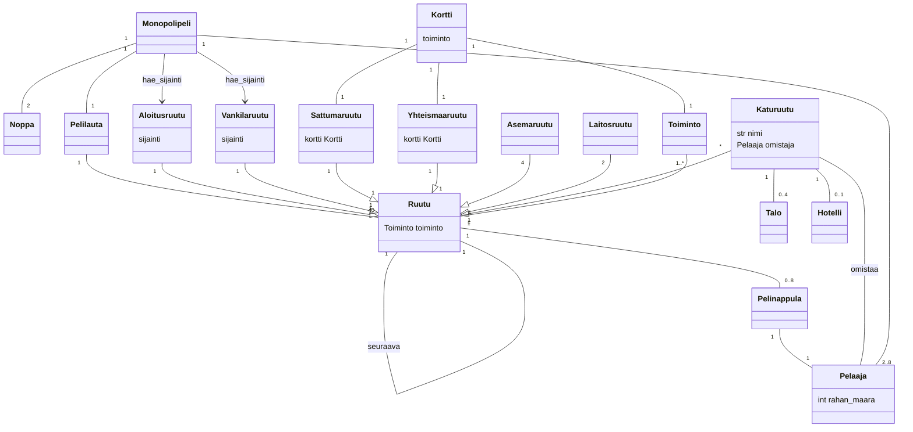

```mermaid
classDiagram
    Monopolipeli "1" -- "2" Noppa
    Monopolipeli "1" -- "1" Pelilauta
    Pelilauta "1" -- "40" Ruutu
    Ruutu "1" -- "1" Ruutu : seuraava
    Ruutu "1" -- "0..8" Pelinappula
    Pelinappula "1" -- "1" Pelaaja
    Pelaaja "2..8" -- "1" Monopolipeli
    Aloitusruutu "1" --|> "1" Ruutu
    Vankilaruutu "1" --|> "1" Ruutu
    Sattumaruutu "1" --|> "1" Ruutu
    Yhteismaaruutu "1" --|> "1" Ruutu
    Asemaruutu "4" --|> "1" Ruutu
    Laitosruutu "2" --|> "1" Ruutu
    Katuruutu "*" --|> "1" Ruutu
        Katuruutu: str nimi
        Katuruutu: Pelaaja omistaja
    Ruutu: Toiminto toiminto
    Toiminto "1..*" -- "1" Ruutu
    Kortti: toiminto
    Kortti "1" -- "1" Yhteismaaruutu
    Kortti "1" -- "1" Sattumaruutu
    Sattumaruutu: kortti Kortti
    Yhteismaaruutu: kortti Kortti
    Kortti "1" -- "1" Toiminto
    Aloitusruutu: sijainti
    Vankilaruutu: sijainti
    Monopolipeli --> Aloitusruutu: hae_sijainti
    Monopolipeli --> Vankilaruutu: hae_sijainti
    Pelaaja: int rahan_maara
    Katuruutu -- Pelaaja: omistaa
    Katuruutu "1" -- "0..4" Talo
    Katuruutu "1" -- "0..1" Hotelli
```